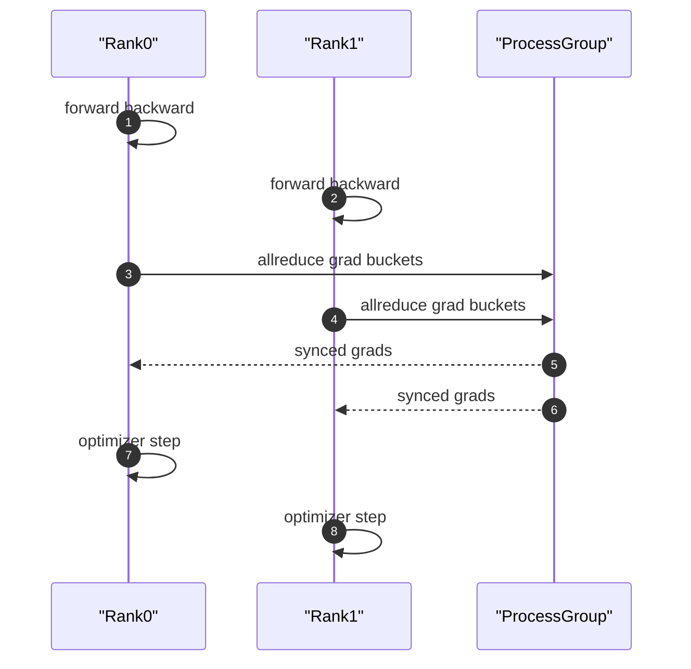
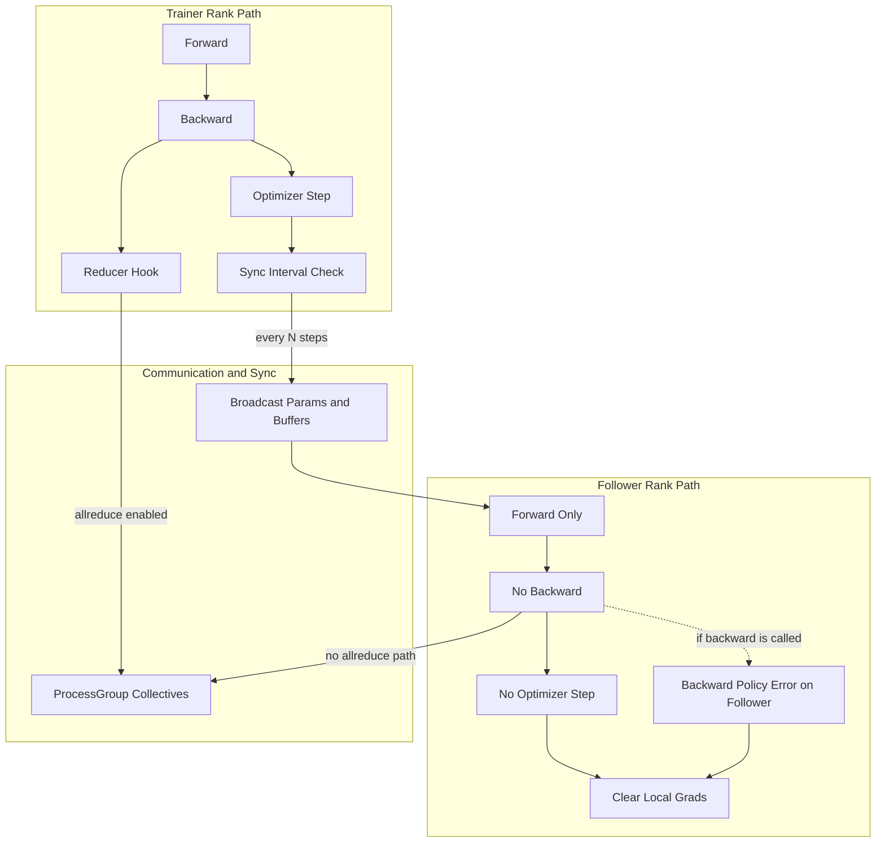
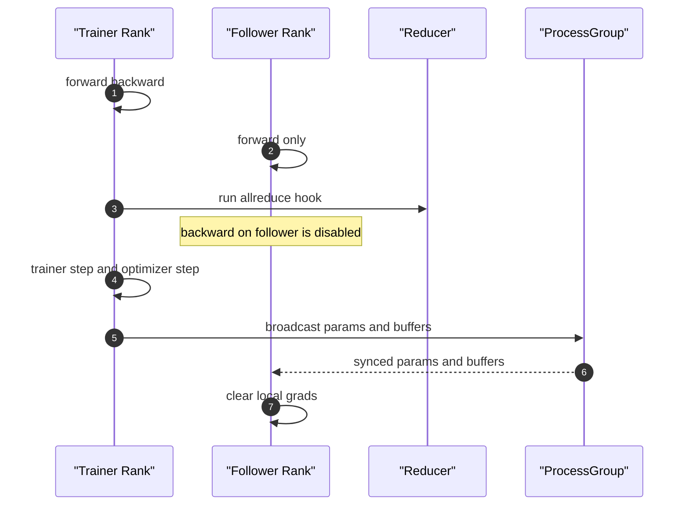

# PyTorch 分布式训练（九）：从同构 AllReduce 到异构参数同步（魔改 DDP 详解）

**源码与 API 版本**：本文以当前改造分支代码为主，同时对照官方 PyTorch 2.5 语义。本文只讨论 DDP 训练路径本身，不引入其它平台背景。

## 背景：为什么要改

标准 DDP 的设计目标是“多卡对称训练”：所有 rank 都做完整反向并参与 allreduce。这在纯训练场景下很有效，但在实际业务部署里经常会遇到另一类诉求：

1. 只有一部分节点承担真实训练与参数更新职责；  
2. 另一部分节点主要承担推理观测、在线校验、隔离运行或资源受限环境下的跟随任务；  
3. 希望跟随节点保持参数同步，但不承担完整 backward + allreduce 成本。

如果继续使用同构 DDP，Follower 仍会进入 backward 和梯度同步路径，带来两类问题：

- **资源问题**：无必要地消耗算力和通信带宽；  
- **职责问题**：业务上并不需要 Follower 参与梯度贡献，却被迫走同一训练语义。

因此改造的核心不是“让 DDP 更快”这么简单，而是把训练系统从**同构角色**改成**角色分工明确**：

- Trainer：负责 forward/backward/step；  
- Follower：只 forward，不 backward，不 step；  
- 一致性通过参数/缓冲区同步维持。

## 1. 原生 DDP 的“同构”训练流程

原生 DDP 的默认假设是：所有 rank 角色对称。

- 每个 rank 都 forward/backward；
- 每个 rank 都参与梯度 allreduce；
- 每个 rank 都本地 `optimizer.step()`。

用 Mermaid 表达如下：



这套流程的关键是：**一致性来自梯度同步**。

## 2. 改造目标：从“同构梯度同步”改为“异构参数同步”

改造目标是把角色拆分为：

- **Trainer rank**：执行完整训练与参数更新；
- **Follower rank**：只走 forward，不走 backward，不参与参数更新；
- 通过参数/缓冲区广播来维持模型一致。

Mermaid 架构图如下：



这张图把关键差异展开成三条链路：Trainer 训练更新链路、Follower 前向专用链路、以及参数/缓冲区同步链路。

## 3. 关键代码改动点

### 3.1 `torch/nn/parallel/distributed.py`

在 DDP 初始化阶段增加了异构配置解析，并将关键参数下传到 `Reducer`：

- `TORCH_DDP_ASYMMETRIC_MODE`
- `TORCH_DDP_TRAINER_RANK`
- `TORCH_DDP_SKIP_ALLREDUCE`
- `TORCH_DDP_HETERO_PARAM_SYNC`
- `TORCH_DDP_NON_TRAINER_FORWARD_ONLY`
- `TORCH_DDP_SYNC_INTERVAL`
- `TORCH_DDP_NON_TRAINER_BACKWARD`

推荐组合是：

- `TORCH_DDP_NON_TRAINER_FORWARD_ONLY=1`
- `TORCH_DDP_NON_TRAINER_BACKWARD=error`

并新增运行时控制方法：

- `is_trainer_rank()`
- `_should_run_backward_runtime()`
- `sync_params_from_trainer()`
- `trainer_step(optimizer)`

这些方法把“角色语义”真正接入训练循环。

### 3.2 `torch/csrc/distributed/c10d/reducer.hpp`

`Reducer` 构造函数新增：

- `int64_t trainer_rank`
- `bool skip_allreduce`

并暴露了角色查询接口：

- `is_trainer_rank()`
- `trainer_rank()`
- `skip_allreduce()`

### 3.3 `torch/csrc/distributed/c10d/reducer.cpp`

`skip_allreduce_` 与 rank 角色绑定，并在 `run_allreduce_hook(...)` 中加入 no-op 分支：

- 若 `skip_allreduce_` 为真，返回 completed future（不发 allreduce）；
- 否则走默认 `_AllReduceBySumCommHook`。

这保证了即便跳过 allreduce，也不破坏 Reducer 对 future/状态机的调用约定。

### 3.4 `torch/csrc/distributed/c10d/init.cpp`

Python 绑定导出了新增参数与 getter（如 `_is_trainer_rank`、`_skip_allreduce`），让 Python 层可感知 C++ Reducer 的角色状态。

## 4. 改造后训练时序

改造后高层时序：



这一时序中，一致性来源已经变化为：**Trainer 更新 + 周期性参数同步**。

## 5. 与原生 DDP 相比，语义变化总结

不变：

- 仍基于 DDP 外壳与 `ProcessGroup`；
- 仍使用 Reducer bucket 机制与 comm hook 框架。

改变：

- 一致性来源：梯度对齐 -> 参数同步；
- rank 语义：同构 -> trainer/follower 异构；
- follower 不再进入 backward 路径。

## 6. 最小使用示例

```python
import os
from torch.nn.parallel import DistributedDataParallel as DDP

os.environ["TORCH_DDP_ASYMMETRIC_MODE"] = "1"
os.environ["TORCH_DDP_TRAINER_RANK"] = "0"
os.environ["TORCH_DDP_SYNC_INTERVAL"] = "1"
os.environ["TORCH_DDP_NON_TRAINER_FORWARD_ONLY"] = "1"
os.environ["TORCH_DDP_NON_TRAINER_BACKWARD"] = "error"
os.environ["TORCH_DDP_HETERO_PARAM_SYNC"] = "1"

ddp_model = DDP(model, ...)

for batch in loader:
    out = ddp_model(batch)
    loss = criterion(out, target)
    if ddp_model.is_trainer_rank():
        loss.backward()
    ddp_model.trainer_step(optimizer)
    optimizer.zero_grad(set_to_none=True)
```

`trainer_step()` 是这套异构路径的统一入口：它同时承担“谁 step、何时同步参数”的调度职责。

## 7. 图示说明

本文包含三张 Mermaid 图，分别用于表达：

- 原生 DDP 的同构训练流程；
- 异构改造后的角色拆分与参数同步路径；
- 异构改造后的训练时序。

