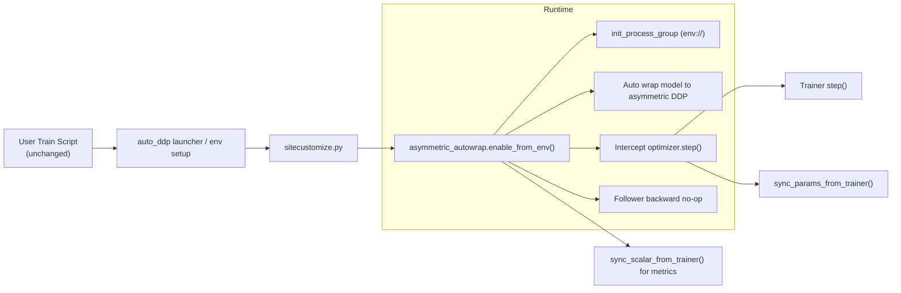

# PyTorch 分布式训练（十一）：异构 DDP 二次改造（去掉 Follower 前向 + 用户代码零侵入）

**上一篇**《09-从同构AllReduce到异构参数同步-魔改DDP详解》完成了“同构梯度同步 -> 异构参数同步”的核心改造。  
这一篇聚焦两项工程化升级：

1. **Follower 不再执行 forward**（进一步压缩 CPU 侧无效计算）；  
2. **用户训练脚本 0 修改接入**（通过 launcher + runtime auto-wrap）。

---

## 1. 问题回顾：为什么要继续改

在第一版异构 DDP 中，虽然 Follower 不做 backward/step，但仍然会执行 forward。  
这会导致两类问题：

- CPU Follower 仍消耗大量算力；
- Trainer 仍受 Follower 节奏影响，整体 wall-time 不理想。

另外，第一版使用上仍要求业务代码写角色分支（例如 `is_trainer_rank()`）。  
这与“平台化、无感接入”的目标还有距离。

---

## 2. 二次改造目标

### 目标 A：Follower 完全跳过前向

- Trainer：`forward -> loss -> backward -> step -> sync params`
- Follower：不执行模型前向，仅参与同步与状态推进
- Loss 指标由 Trainer 广播给 Follower，保证日志可观测

### 目标 B：用户代码零侵入

- 用户仍执行原始 `python train.py [args...]`
- 不要求显式导入 DDP，不要求写 `is_trainer`
- 通过外层注入环境与运行时自动包装完成异构接管

---

## 3. 架构变化（相对 09）



核心变化：把“训练脚本中的角色分支逻辑”下沉到 runtime 层。

---

## 4. 关键实现点

## 4.1 Follower 跳过 forward

在 auto-wrap 运行时中，Follower 命中“跳过前向”分支时，返回一个内部 token，避免执行真实模型计算；  
随后在 loss 计算路径中由 Trainer 广播标量 loss，Follower 侧直接消费该值用于日志。

好处：

- CPU 侧减少大量计算；
- 指标仍保持一致可比；
- 训练语义不依赖业务层显式分支。

## 4.2 自动角色接管与参数同步

运行时自动完成：

- rank 角色判定（trainer/follower）
- `optimizer.step()` 的 trainer-only 执行
- 周期性 `sync_params_from_trainer()`（按 sync interval）
- follower 的 backward no-op

也就是说，用户脚本里即便是标准单机循环，也能被接管到异构语义。

## 4.3 严格启动与失败保护

为避免“分布式初始化失败但误跑本地训练”的风险，新增严格启动路径：

- `launch_user.py` 先执行 runtime 初始化；
- 初始化失败直接退出，不继续执行用户脚本。

此外补充：

- `GLOO_SOCKET_IFNAME` 自动探测；
- loopback 地址误用保护（`MASTER_ADDR=127.0.0.1` 在多机时直接报错）。

---

## 5. 用户接入方式（代码 0 修改）

有两种方式，业务脚本都不改。

### 方式 1：直接 launcher

```bash
# trainer
MASTER_ADDR=10.60.82.27 MASTER_PORT=29623 \
./pytorch_fork_asymmetric_ddp/auto_ddp/run_user_trainer.sh train.py --epochs 100

# follower
MASTER_ADDR=10.60.82.27 MASTER_PORT=29623 \
./pytorch_fork_asymmetric_ddp/auto_ddp/run_user_follower.sh train.py --epochs 100
```

### 方式 2：保留用户原命令（平台常用）

```bash
# trainer
source ./pytorch_fork_asymmetric_ddp/auto_ddp/setup_env_trainer.sh && python3 train.py --epochs 100

# follower
source ./pytorch_fork_asymmetric_ddp/auto_ddp/setup_env_follower.sh && python3 train.py --epochs 100
```

这种方式尤其适合“平台只拿到用户原始命令、不能改命令结构”的场景。

---

## 6. 调试与低噪声耗时分析

二次改造后，支持两类观测：

- 细粒度事件日志（debug）
- 低噪声汇总日志（summary）

示例：

```bash
TORCH_DDP_ASYMMETRIC_SUMMARY=1 \
TORCH_DDP_ASYMMETRIC_STEPS_PER_EPOCH=194 \
TORCH_DDP_ASYMMETRIC_DEBUG=0 \
source ./pytorch_fork_asymmetric_ddp/auto_ddp/setup_env_trainer.sh && python3 train.py
```

如需有限采样的 debug：

```bash
TORCH_DDP_ASYMMETRIC_DEBUG=1 \
TORCH_DDP_ASYMMETRIC_DEBUG_EVERY_N=50 \
TORCH_DDP_ASYMMETRIC_DEBUG_EVENTS=optimizer_step_local_trainer,sync_params_from_trainer,sync_scalar_from_trainer \
source ./pytorch_fork_asymmetric_ddp/auto_ddp/setup_env_trainer.sh && python3 train.py
```

---

## 7. 与 09 版能力对比

| 维度 | 09 版 | 11 版（二次改造） |
|---|---|---|
| Follower 前向 | 仍执行 | 可跳过（默认可开） |
| 指标来源 | 各自本地/脚本处理 | Trainer 广播到 Follower |
| 用户脚本角色分支 | 需要写 | 不需要写 |
| DDP 显式导入 | 通常需要 | 可由 runtime 自动接管 |
| 启动失败保护 | 一般 | 严格失败即退出 |
| 调试方式 | 明细日志为主 | 支持 summary 低噪声汇总 |

---

## 8. 边界与适用范围

“零侵入”主要针对标准训练范式（单模型、单优化器、标量 loss）。  
对于复杂场景（多模型交织、closure、自定义控制流损失），建议先关闭 forward skip 或使用兼容模式。

结论不是“所有脚本 100% 无脑托管”，而是：

> 对主流训练脚本，可实现“代码 0 修改 + 异构语义自动接管 + 可观测 + 可回退”。

---

## 9. 总结

这次二次改造把异构 DDP 从“可用原型”推进到“工程可接入”：

- 性能上：进一步削减 Follower 侧无效计算；
- 体验上：用户脚本不再显式感知分布式细节；
- 运维上：初始化失败可控、日志可分析、问题可定位。

如果 09 版回答的是“能不能做”，这篇 11 版回答的是“能不能稳定给别人用”。

